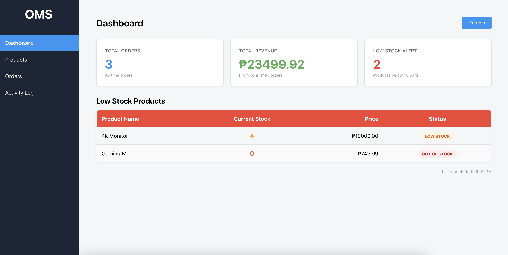
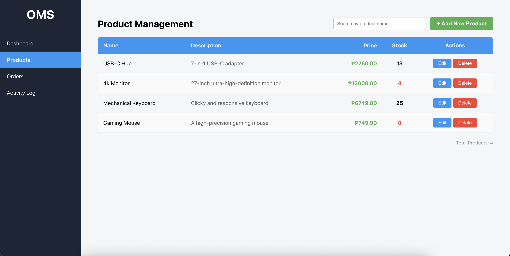
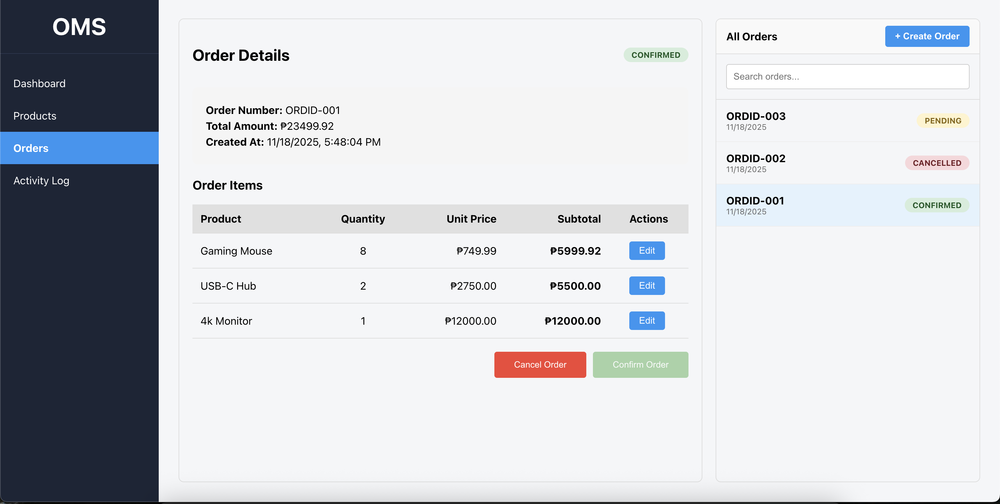
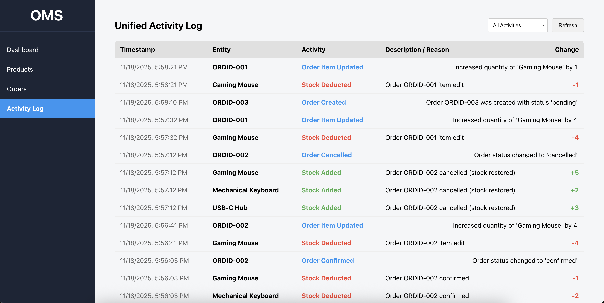

# Order Management System

A full-stack order management application built with Django REST Framework and React. This project demonstrates a complete order processing system with inventory management, automated stock tracking, and comprehensive activity logging.

**👉 For detailed setup and usage instructions, see [setup-instructions.md](setup-instructions.md)**

---

## Features

### Core Functionality
- 📊 **Dashboard** - Real-time statistics for total orders, revenue, and low stock alerts
- 📦 **Product Management** - Full CRUD operations with automatic inventory logging
- 🛒 **Order Creation** - Multi-item orders with real-time stock validation
- ✅ **Order Management** - Confirm orders (with atomic stock deduction) and perform full or partial cancellations
- 📝 **Activity Log** - Unified timeline combining inventory changes and order activities

### Key Highlights
- ⚡ **Transaction Safety** - Database-level locking prevents race conditions and overselling
- 🔄 **Automatic Inventory Management** - Stock automatically deducted on order confirmation and restored on cancellation
- 🧪 **Handling of Edge Cases** - Negative inventory prevented and app will block orders being confirmed if pending products and its quantities are greater than available stock. The same is true if an order is being created that asks for more stocks of an item than what's available.
- 🛑 **Invalid Inputs/Error Handling** - Clear messages to the user for invalid amounts entered when creating products or orders. Similarly, lack of inventory messages are displayed and prevents any changes if the user confirms or creates an order exceeding the stock that's available.

---

## Screenshots

### Dashboard
Real-time statistics and low stock alerts:



### Product Management
Full CRUD operations with inventory tracking:



### Order Management
Create and manage orders with stock validation:



### Activity Log
Unified timeline of all system activities:



---

## Tech Stack

This project uses a classic and robust combination for full-stack web applications. Django and Django REST Framework provide a powerful and secure backend, ideal for rapid development of the RESTful API needed for order and inventory management. React is used for the frontend to create a dynamic and responsive user interface, allowing for a seamless user experience especially considering all the live updates expected from the logs, orders, and products (with its stocks). SQLite is used as a simple and file-based database, ideal for development and demonstration purposes.

### Backend
- **Django 5.2.8** - Web framework
- **Django REST Framework 3.16.1** - RESTful API
- **SQLite** - Database (development)
- **django-cors-headers 4.9.0** - CORS handling

### Frontend
- **React 19.2.0** - UI framework
- **Axios** - HTTP client
- **CSS3** - Styling 

---

## Quick Start

### Prerequisites
- Python 3.11+
- Node.js 16+ and npm
- Git

### Installation & Running

```bash
# Clone the repository
git clone <repository-url>
cd order-management-system

# Option 1: One-command start (macOS)
./start-all.sh

# Option 2: Manual start (all platforms)
# Terminal 1 - Backend
./start-backend.sh

# Terminal 2 - Frontend
./start-frontend.sh
```

**Access the application:**
- http://localhost:3000

📖 **For detailed setup instructions, troubleshooting, and testing guides, see [setup-instructions.md](setup-instructions.md)**


---

## Challenges Faced & Solutions


